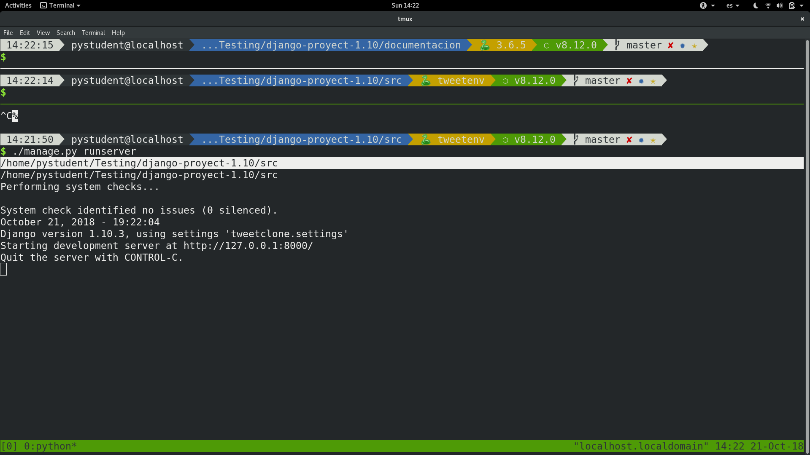
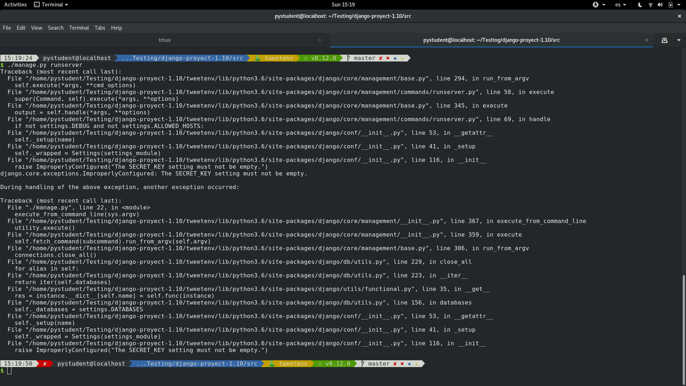
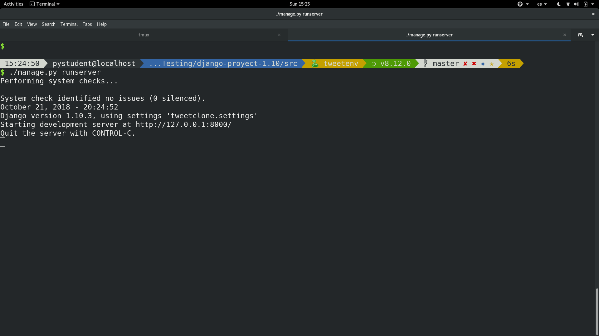

# Archivos de configuracion en Django

Aqui veremos todo lo relacionado con nuestro archivo **settings.py** y como ahi podremos configurar diferentes aspectos de nuestro proyecto.

## Lo primero que podemos ver en nuestro archivo settings 

Es esta linea de codigo:

```python
# Build paths inside the project like this: os.path.join(BASE_DIR, ...)
BASE_DIR = os.path.dirname(os.path.dirname(os.path.abspath(__file__)))
```

Entonces que significa esto?
Esta linea es **muy importante** porque permite a django saber en que directorio se encuentra y si queremos saber que devuelve podemos hacer lo siguiente:

```python
# debajo de BASE_DIR
print(BASE_DIR)
```

Y corremos el servidor para ver que nos muestra:




## Ahora la segunda cosa que debemos tener en cuenta

Es que este archivo settings seria el archivo **principal de configuracion** de todo nuestro proyecto. Pero para nuestros propositos mas "ambiciosos" tener solo un archivo de configuracion general para todas las etapas de nuestro proyecto, seria un poco desordenado o mejor dicho una pesima practica. 
Porque lo optimo seria tener un archivo de configuracion para cada ambiente de desarrollo que vayamos a tener (como produccion, local, testing, etc, etc). Asi que para solucionar esto **Django** tiene una forma muy elegante de manejar este tipo de requerimientos que necesitamos los desarrolladores. Y lo veremos a continuacion.

Para empezar debemos crear dentro de nuestra carpeta de configuracion del proyecto, una carpeta llamada settings:

```console
$ pwd 
/home/pystudent/Testing/django-proyect-1.10/src/tweetclone
$ mkdir settings
$ ls
__init__.py  __pycache__  settings  settings.py  urls.py  wsgi.py
```

Usamos **pwd** para ver nuestro path actual (por si quieren estar seguros de donde se encuentran) y **ls** para ver como queda nuestra carpeta de configuracion luego de crear esta nueva carpeta. 
Cabe recalcar que todos estos comandos son usados en linux (especificamente **FEDORA28** mi sistema operativo actual, en caso de usar windows u otro sistema que difiera se tendria que buscar su equivalente o hacerlo desde el gestor de archivos).

Luego de esto debemos mover nuestro archivo **settings.py** dentro de la carpeta settings para poder trabajarla desde ahi. 

```console
$ mv settings.py settings

$ cd settings
```

**NOTA:** Ahora un punto **importante** como hemos creado nuestra carpeta settings debemos volverla un **modulo de python** y como que hace eso ?. Pues facil solo debemos crear un archivo **__init__.py**  de la siguiente manera:

```console
$ touch __init__.py
```

Ahora vamos a crear nuestro archivos de configuracion personalizados en este caso solo creare 3:

```console
$ touch {base,local,production}.py
# esta seria una forma corta de crear varios archivos de una misma extension
```

Y dentro de estos archivos pondremos las configuraciones necesarias para cada aspecto del desarrollo que vayamos a tener (podemos crear cuantos archivos de configuracion nos plazca no existe un limite alguno).

Una cosa a resaltar es que cuando queremos que nuestro proyecto este en produccion debemos cambiar el valor de la variable **DEBUG** a Falso:

```python
DEBUG = False
```

Y tambien, otra muy muy muuuuuuuuuuuuy importante es que ahora nuestro archivo **BASE_DIR** no señalaria a donde querriamos especificamente, entonces deberiamos cambiarlo de la siguiente manera:


```python
BASE_DIR = os.path.dirname(os.path.dirname(os.path.dirname(os.path.abspath(__file__))))
```

Y porque ? porque el comando **os.path.dirname** nos devuelve por asi decirlo la carpeta contenedora del archivo, y como nosotros hemos creado una nueva carpeta. Ahora tendriamos que decirle a django que tiene que ir un nivel mas arriba para llegar a la ruta que esperamos.

**NOTA 2:** Si quieren probar lo que estoy diciendo pueden hacer lo siguiente (una vez podamos correr el servidor):

```python
# agregamos estas dos lineas despues de la de BASE_DIR normal para no afectar nada y corramos el servidor
OLD_BASE_DIR = os.path.dirname(os.path.dirname(os.path.dirname(os.path.abspath(__file__))))
NEW_BASE_DIR = os.path.dirname(os.path.dirname(os.path.dirname(os.path.abspath(__file__))))

print(OLD_BASE_DIR)
print(NEW_BASE_DIR)
```

## Ahora intentemos correr el servidor luego de crear nuestor archivos configuracion

Con el comando:

```console
$ ./manage.py runserver
```

Nos saldria un error como este:



Y no chicos no fue culpa de ustedes (excepto con ella eso si fue su culpa :"v). 
Sino que debemos hacer un paso mas para que esto funcione y este sera agregar un poco de codigo de python en nuestro archivo **__init__.py**.

```python
from .base import *

from .production import *

try:
	from .local import *
except:
	pass
```

Ahora si volvemos a correr el servidor nos funcionaria:




Oh y lo olvidaba, ya pueden borrar el archivo **settings.py** puesto ya lo hemos usado no habria necesidad de seguir usandolo.  


